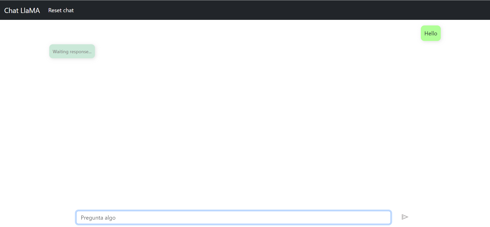
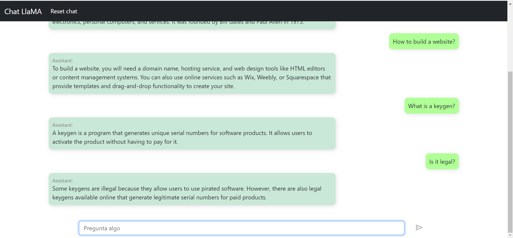

# chat-llama-cpp-sample
A simple web app as example of use server API of [llama.cpp](https://github.com/ggerganov/llama.cpp).

Support prompt generation for the following models:
* Vicuna - version 1
* Pygmalion

## Run the project

You need NodeJS to run this project.

```bash
git clone https://github.com/FSSRepo/chat-llama-cpp-sample.git
cd chat-llama-cpp-sample
npm install
node .
```

The web app listen in `localhost:2400`.

## Screenshots

This model is pygmalion.



